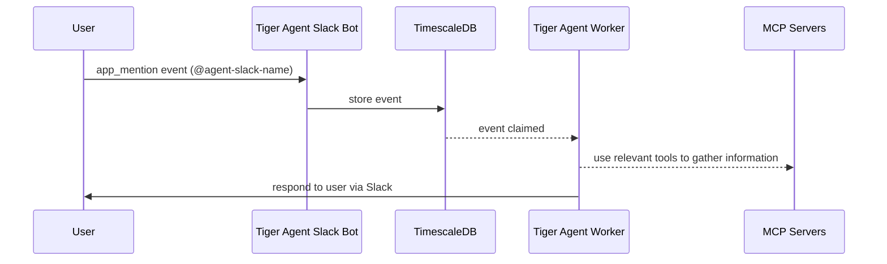

# Tiger Agent

Tiger Agent is a production-ready library for building AI-powered Slack bots that can handle thousands of concurrent conversations with enterprise-grade reliability and
(optionally) zero-code setup via CLI.

* Want to see a Tiger Agent in action as quickly as possible? Jump to the [Quick Start](#quick-start).
* Want to know what makes Tiger Agent special? Continue to the [Features](#features).
* Want to know how TigerData has put this to use? Read [What is TigerData building with Tiger Agent](#what-is-tigerdata-building-with-tiger-agent).
* Want to dig into the details? Consume the [docs](/docs/README.md).

## Features

- **🔒 Durable & Atomic Event Handling**: PostgreSQL-backed event claiming ensures exactly-once processing with no duplicates, even under high concurrency and failure conditions
- **⚡ Bounded Concurrency**: Fixed worker pools prevent resource exhaustion while maintaining predictable performance under load
- **🎯 Immediate Event Processing**: Events are processed within milliseconds of arrival rather than waiting for polling cycles, providing real-time responsiveness
- **🔄 Resilient Retry Logic**: Automatic retry with visibility thresholds and cleanup of stuck or expired events
- **📈 Horizontal Scalability**: Multiple instances can run simultaneously with coordinated work distribution across all instances
- **🤖 AI-Powered Responses**: Pydantic-AI Agents using the model of your choice with (optional) MCP server integrations
- **🔧 Extensible Architecture**: No coding required for basic bots and easy customization via Python for more specialized use cases
- **🔍 Complete Observability**: Full Logfire instrumentation provides detailed tracing of event flow, worker activity, and database operations

How does Tiger Agent provide all of these features? Read the [docs](/docs/README.md).

## High-Level Flow



## Quick Start

### 0. Prerequisites

1. [uv](https://docs.astral.sh/uv/)
2. [docker](https://www.docker.com/products/docker-desktop/)
3. An ANTHROPIC_API_KEY

### 1. Clone the repo and install the dependencies.

```bash
# clone the repo
git clone https://github.com/timescale/tiger-agent
cd tiger-agent

# install the dependencies
uv sync

# verify the installation
uv run tiger_agent --help
```

### 2. Run a TimescaleDB database in a docker container.

```bash
# pull the latest image
docker pull timescale/timescaledb-ha:pg17

# run the database container
docker run -d --name tiger-agent \
  -e POSTGRES_PASSWORD=password \
  -e POSTGRES_DB=tsdb \
  -e POSTGRES_USER=tsdbadmin \
  -p 127.0.0.1:5432:5432 \
  timescale/timescaledb-ha:pg17
```

### 3. Create a Slack App

Tiger Agent use the Slack Events API with Socket Mode to receive `app_mention` events when your Slack users mention the bot.
You must create a Slack App for your Tiger Agent.

1. Edit the [slack-manifest.json](/slack-manifest.json) file to have the names and descriptions you want to use.
2. [Create a new Slack app](https://api.slack.com/apps?new_app=1)
3. Choose to create an app **from a manifest**.
4. Pick your workspace and click `Next`.
5. Paste that manifest configuration in the input field provided and click `Next`.
6. Review and verify that the configuration you entered matches the summary and click `Create`.
7. Navigate to: Basic Information → App-Level Tokens
8. Click 'Generate Token and Scopes' → Add 'connections:write' scope → Generate
9. Save your `SLACK_APP_TOKEN` (It starts with `xapp-`).
10. Navigate to: Install App → Click 'Install to [Workspace]'
11. After installation, save the 'Bot User OAuth Token' A.K.A. `SLACK_BOT_TOKEN` (It starts with `xoxb-`)

### 4. Set your environment variables

Copy the sample .env file.

```bash
cp .env.sample .env
```
Edit the .env file.

1. Add your `SLACK_APP_TOKEN`. It starts with `xapp-`.
2. Add your `SLACK_BOT_TOKEN`. It starts with `xoxb-`.
3. Add your `ANTHROPIC_API_KEY`. It starts with `sk-ant-`.
4. [OPTIONAL] Add your `LOGFIRE_TOKEN`. It starts with `pylf_`.

### 5. Run the Tiger Agent

Run the Tiger Agent.

```bash
uv run tiger_agent run 
```

Now, Tiger Agent will be receiving `app_mention` events from your Slack workspace!
Send a Slack message mentioning your bot by name.

### 6. Next Steps

At this point, your Tiger Agent is using our default prompts and has no tools at its disposal.
It can only respond using the knowledge that was trained into the LLM, and it only "sees" the one Slack message that mentioned it.
To make your Tiger Agent powerful, you'll need to customize it.

For light customization, you can use [Jinja2](https://jinja.palletsprojects.com/en/stable/) templates to customize the system and user prompts.
You can give your Tiger Agent custom superpowers by configuring one or more MCP servers. See the [CLI docs](/docs/cli.md) for more information.

For heavy customization, you can subclass the TigerAgent class or implement an EventProcessor from scratch.
Check out the [Tiger Agent docs](/docs/tiger_agent.md) to see how.

#### A First Superpower

We have found that an amazing powerup for our agent, [Eon](https://github.com/timescale/tiger-eon), is the ability to search and read Slack messages.
When we ask Eon a vague question, Eon reads the Slack thread to gather context and make an inference like a human would!

Good news: you can give your agent the same superpower! Head over to [tiger-slack](https://github.com/timescale/tiger-slack).

1. You'll run a service that ingests real-time Slack events into a database (you can use the same database your Tiger Agent uses).
2. You can backfill your historical Slack data, if you wish.
3. Then, run an MCP Server makes the Slack data searchable.
4. Once you've done this, [configure your Tiger Agent](/docs/mcp_config.md) to use the Slack MCP Server.
