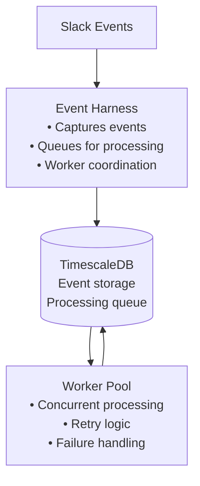

# Tiger Agent

A Slack event processing harness that captures Slack events and provides queued processing with worker pools for reliable event handling.

## Architecture

For detailed technical documentation, see [architecture.md](./architecture.md).



## Getting Started

### Installation

```bash
# Install dependencies
uv sync

# Set up environment variables
cp .env.sample .env
# Edit .env with your configuration

# Run database migrations
uv run python -m tiger_agent.migrations.runner

# Start the harness
uv run python -m tiger_agent.main
```

### Environment Variables

First, initialize your environment configuration:

```bash
cp .env.sample .env
```

#### Required Variables

**Slack Integration** (Required):
```bash
SLACK_BOT_TOKEN=xoxb-your_bot_token_here
SLACK_APP_TOKEN=xapp-your_app_token_here
```

**Note**: Database variables (`PGHOST`, `PGDATABASE`, etc.) are pre-configured for the Docker setup and typically don't need modification.

## Docker Deployment

### Quick Start

Use the provided startup script:

```bash
./start.sh
```

This script will:
1. Build Docker images
2. Start core services (app, database, Slack ingest)

### Manual Docker Commands

```bash
# Build and start all services
docker-compose build
docker-compose up -d

# Start core services
docker-compose up -d app db tiger-slack-ingest

# View logs
docker-compose logs -f app
```

### Event Processing

The system processes Slack events through a reliable queue-based architecture:
- **Event Capture**: Slack events are immediately acknowledged and stored
- **Queue Processing**: Worker pool processes events with retry logic
- **Failure Handling**: Failed events are retried with exponential backoff
- **Monitoring**: Full observability through Logfire integration