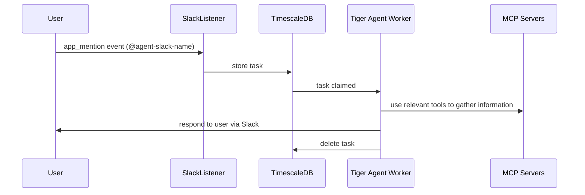

# Task Harness Architecture

The TaskHarness is the core task processing engine of Tiger Agent, providing a robust, scalable, and responsive system for handling Slack app_mention events. It combines the durability of PostgreSQL-backed queuing with the responsiveness of asyncio-based worker coordination.

## Overview

The TaskHarness orchestrates a sophisticated task processing pipeline that receives Slack events, stores them durably in PostgreSQL as tasks, and coordinates multiple workers to process tasks efficiently. It's designed to handle high volumes of concurrent tasks while maintaining strong reliability guarantees.

External events arrive via **listeners** (`SlackListener`, `SalesforceListener`), which normalize them into tasks and enqueue them. The TaskHarness then claims and dispatches those tasks to a `TaskProcessor` (typically `TigerAgent`).

## Key Features & Benefits

### **Immediate Responsiveness**
Tasks are processed immediately upon arrival rather than waiting for periodic polling cycles. When a Slack mention occurs, processing begins within milliseconds.

### **Bounded Concurrency**
Fixed worker pool prevents resource exhaustion and provides predictable performance characteristics. No matter how many tasks arrive, the system maintains controlled resource usage.

### **Atomic Task Processing**
Database-level task claiming ensures exactly-once processing with no duplicates, even under high concurrency and failure conditions.

### **Resilient Retry Logic**
Failed tasks are automatically retried with visibility thresholds. Stuck or expired tasks are cleaned up automatically.

### **Horizontal Scalability**
Multiple harness instances can run simultaneously, with PostgreSQL coordinating work distribution across all instances.

### **Full Observability**
Complete instrumentation with Logfire provides detailed tracing of task flow, worker activity, and database operations.

## High-Level Flow



## Architecture Components

### Core Components

#### **HarnessContext**
Shared context object providing task processors with:
- **Slack AsyncApp**: For making Slack API calls
- **Database Pool**: For data operations and persistence
- **TaskGroup**: For spawning concurrent operations

#### **Task Model**
- **Task**: Database representation with processing metadata (id, attempts, vt, claimed, event payload)

#### **Listeners**
- **SlackListener**: Receives Slack events via Socket Mode and enqueues tasks
- **SalesforceListener**: Receives Salesforce events and enqueues tasks

#### **Worker Coordination**
- **Multiple Workers**: Configurable pool of concurrent processors
- **Task Claiming**: Atomic database-level work distribution
- **Load Balancing**: Random task selection spreads work evenly

## Implementation Mechanisms

### 1. Immediate Task Handling ("Poke" Mechanism)

When Slack events arrive:

```python
async def _on_event(self, ack: AsyncAck, event: dict[str, Any]):
    await insert_event(event)           # Store durably
    await ack()                         # Acknowledge to Slack
    await self._trigger.put(True)       # Wake exactly one worker
```

**Key Behavior**: The asyncio.Queue trigger wakes exactly **one worker**, not all workers. This prevents thundering herd effects while ensuring immediate processing.

### 2. Atomic Task Claiming

Workers compete for tasks using PostgreSQL's atomic operations:

```sql
-- agent.claim_event() function provides:
-- - Random selection to avoid head-of-line blocking
-- - FOR UPDATE SKIP LOCKED for efficient concurrency
-- - Visibility threshold updates for retry logic
SELECT * FROM agent.claim_event(max_attempts, invisibility_interval);
```

**Guarantees**:
- Only one worker can claim each task at a time
- Failed claims don't block other workers
- Automatic retry scheduling via visibility thresholds

### 3. Resilient Worker Architecture

Each worker operates in a hybrid trigger/polling model:

```python
while True:
    try:
        # Wait for immediate trigger OR timeout for polling
        await asyncio.wait_for(
            self._trigger.get(),
            timeout=self._calc_worker_sleep()
        )
        await worker_run()  # Immediate processing
    except TimeoutError:
        await worker_run()  # Periodic cleanup
```

**Benefits**:
- **Immediate**: Most tasks processed within milliseconds
- **Resilient**: Periodic polling catches missed/failed tasks
- **Efficient**: Jittered timeouts prevent worker synchronization

### 4. Batch Task Processing

Triggered workers process tasks in batches for efficiency:

```python
async def process_tasks(...):
    for _ in range(20):  # Process up to 20 tasks per trigger
        task = await claim_event(...)
        if not task:
            return  # No more work available
        if not await process_task(..., task):
            return  # Failed processing, stop and retry later
```

**Advantages**:
- **Efficient**: Single trigger processes multiple tasks
- **Controlled**: Bounded batch size prevents runaway processing
- **Fail-Fast**: Early termination on failures preserves retry opportunities

### 5. Database-Backed Durability

The system uses PostgreSQL's `agent.event` table as a durable work queue:

- **Insert**: New tasks stored with `attempts=0`, `vt=now()`
- **Claim**: Workers atomically claim tasks with future visibility threshold
- **Success**: Completed tasks moved to `agent.event_hist`
- **Failure**: Tasks remain visible for retry after threshold expires
- **Cleanup**: Expired tasks automatically moved to history

### 6. Worker Coordination & Load Balancing

#### Staggered Startup
Workers start at different times to distribute initial load:

```python
initial_sleeps = [0] + random.sample(range(1, worker_sleep_seconds), num_workers-1)
```

#### Jittered Polling
Random sleep intervals prevent thundering herd effects:

```python
def _calc_worker_sleep(self) -> int:
    jitter = random.randint(min_jitter, max_jitter)
    return base_sleep + jitter
```

#### Random Task Selection
Database function uses `ORDER BY random()` to prevent head-of-line blocking.

## Operational Characteristics

### Performance Profile
- **Latency**: Sub-millisecond task processing initiation
- **Throughput**: Scales linearly with worker count
- **Resource Usage**: Bounded by worker pool size
- **Database Load**: Efficient with connection pooling and prepared statements

### Failure Modes & Recovery
- **Worker Death**: Tasks auto-retry after visibility threshold
- **Database Unavailable**: Events queued in Slack until reconnection
- **Processing Failures**: Automatic retry with visibility threshold
- **Poisoned/Expired Tasks**: Moved to history table after max attempts or max age

### Configuration Parameters
- **num_workers**: Concurrency level (default: 5)
- **max_attempts**: Retry limit per task (default: 3)
- **max_age_minutes**: Maximum age of a task before expiring (default: 60)
- **invisibility_minutes**: Claim duration (default: 10)
- **worker_sleep_seconds**: Polling interval (default: 60)
- **worker_min/max_jitter_seconds**: Adds random jitter to worker sleep

## Monitoring & Observability

All operations are instrumented with Logfire spans providing:

- **Task Flow Tracking**: From ingestion through completion
- **Worker Activity**: Trigger vs timeout reasoning
- **Database Performance**: Query timing and connection usage
- **Failure Analysis**: Exception details and retry patterns
- **Load Distribution**: Worker utilization and task claiming patterns

The TaskHarness represents a sophisticated balance of immediate responsiveness, operational resilience, and resource efficiency - providing Tiger Agent with enterprise-grade task processing capabilities.
