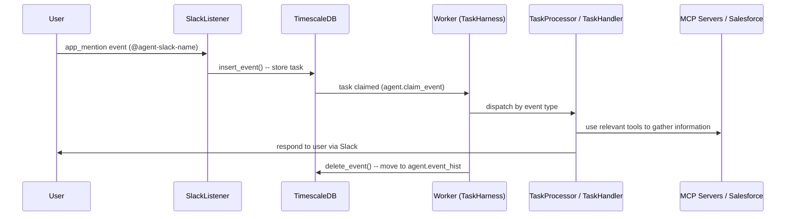

# Task Harness Architecture

Tiger Agent's runtime is split into two cooperating pieces that share a single `HarnessContext`:

- **Listeners** (`tiger_agent/listeners/`) receive external events — Slack Events API/Socket Mode events and Salesforce PushTopic/polling events — normalize them into typed `Task` payloads, and enqueue them durably in PostgreSQL.
- **The `TaskHarness`** (`tiger_agent/tasks/harness.py`) runs a bounded pool of workers that atomically claim queued tasks and dispatch them to a `TaskProcessor`.

`TigerApp` (`tiger_agent/app.py`) is the object that wires both together: it builds a `TaskProcessor`, registers every built-in `TaskHandler`, and runs the `ListenerHarness` and `TaskHarness` side by side in one `asyncio.TaskGroup`.

## Overview

External events arrive via **listeners** (`SlackListener`, `SalesforceListener`), which normalize them into tasks and enqueue them. The `TaskHarness` then claims and dispatches those tasks to a `TaskProcessor` (typically the `TaskProcessor` built by `TigerApp`, which fans out to per-event-type `TaskHandler`s; a raw `TigerAgent` or any async callable also satisfies the `TaskProcessor` protocol for simpler apps — see [Tiger Agent](tiger_agent.md)).

The system combines the durability of PostgreSQL-backed queuing with the responsiveness of asyncio-based worker coordination, and it processes far more than Slack `app_mention`s: Slack messages, interactive components (buttons, modals), admin slash commands, and a full bidirectional Salesforce Case ↔ Slack thread sync (see [Salesforce Integration](salesforce_sync.md)) all flow through the same queue.

## Key Features & Benefits

### **Immediate Responsiveness**
Tasks are processed immediately upon arrival rather than waiting for periodic polling cycles. When a Slack mention or a Salesforce case event occurs, processing begins within milliseconds.

### **Bounded Concurrency**
Fixed worker pool prevents resource exhaustion and provides predictable performance characteristics. No matter how many tasks arrive, the system maintains controlled resource usage.

### **Atomic Task Processing**
Database-level task claiming ensures exactly-once processing with no duplicates, even under high concurrency and failure conditions.

### **Resilient Retry Logic**
Failed tasks are automatically retried with visibility thresholds. Stuck or expired tasks are cleaned up automatically.

### **Horizontal Scalability**
Multiple harness instances can run simultaneously, with PostgreSQL coordinating work distribution across all instances.

### **Full Observability**
Complete instrumentation with Logfire provides detailed tracing of task flow, worker activity, and database operations.

## High-Level Flow


```mermaid
sequenceDiagram
    participant U as User
    participant SL as SlackListener
    participant TSDB as TimescaleDB
    participant TAW as Worker (TaskHarness)
    participant TP as TaskProcessor / TaskHandler
    participant MCP as MCP Servers / Salesforce

    U->>SL: app_mention event (@agent-slack-name)
    SL->>TSDB: insert_event() -- store task
    TSDB->>TAW: task claimed (agent.claim_event)
    TAW->>TP: dispatch by event type
    TP->>MCP: use relevant tools to gather information
    TP->>U: respond to user via Slack
    TAW->>TSDB: delete_event() -- move to agent.event_hist
```

The same pipeline carries Salesforce-originated events (a case gets created, reassigned, has its status changed, or gets a new Chatter post/email) and Slack-originated events destined for Salesforce (a reply in a case-linked thread). See [Salesforce Integration](salesforce_sync.md) for that flow end-to-end.

## Architecture Components

### Core Components

#### **HarnessContext**
Shared context object (`tiger_agent/types.py`) providing listeners and task processors with:
- **Slack AsyncApp** (`app`): For making Slack API calls
- **Database Pool** (`pool`): For data operations and persistence
- **Trigger Queue** (`trigger`): An `asyncio.Queue` used to "poke" a worker awake
- **Shutdown Event** (`shutdown`): Set when a soft shutdown has been requested
- **Bot info / Salesforce client**: Optional integrations (`bot_info`, `salesforce_client`)
- **Worker configuration**: `num_workers`, `worker_sleep_seconds`, jitter bounds, `max_attempts`, `max_age_minutes`, `invisibility_minutes`

#### **Task Model**
- **Task**: Database representation with processing metadata (`id`, `event_ts`, `attempts`, `vt`, `claimed`, and a discriminated `event` union covering every event type below)

## The Listener Pattern

A **listener** is anything that implements the `Listener` protocol (`tiger_agent/listeners/__init__.py`):

```python
class Listener(ABC):
    @abstractmethod
    async def start(self, tasks: TaskGroup) -> None: ...
```

`start()` is handed the app's `asyncio.TaskGroup` and is expected to register whatever event subscriptions it needs and/or spawn long-running tasks into that group. It returns once setup is complete — the actual listening happens in the background tasks it created.

**`ListenerHarness`** (`tiger_agent/listeners/harness.py`) is itself a `Listener` that composes the concrete listeners for the current deployment:

```python
class ListenerHarness(Listener):
    def __init__(self, hctx: HarnessContext, task_processor: TaskProcessor):
        self._listeners: list[Listener] = [SlackListener(hctx=hctx, task_processor=task_processor)]
        if hctx.salesforce_client:
            self._listeners.append(SalesforceListener(hctx=hctx))

    async def start(self, tasks: TaskGroup):
        for listener in self._listeners:
            await listener.start(tasks=tasks)
```

`SlackListener` is always present. `SalesforceListener` is only added when `hctx.salesforce_client` is configured (i.e. Salesforce credentials are present), so a Tiger Agent deployment with no Salesforce org configured simply never registers it.

Every listener follows the same shape when it receives an external event: normalize the payload into one of the `Task.event` Pydantic models, call `insert_event(pool, event)` to durably enqueue it, and `await hctx.trigger.put(True)` to immediately wake one worker rather than waiting for the next poll.

#### `SlackListener` (`tiger_agent/listeners/slack.py`)

Runs Slack Bolt in Socket Mode and registers handlers for every Slack surface the agent uses, not just `app_mention`:

| Slack surface | Handler | What it does |
| --- | --- | --- |
| `event("app_mention")` | `_on_slack_event` | Enqueues a `SlackAppMentionEvent`; sets a "busy" status on the thread first |
| `event("message")` | `_on_message` | Multiplexes: ignores the bot's own messages; special-cases a bot-posted pseudo-slash-command that opens the new-case form (see below); enqueues a `SlackMessageEvent` for DMs (`channel_type == "im"`); enqueues a `SlackSalesforceCaseThreadMessageEvent` when the message is a reply in a thread linked to a Salesforce case; otherwise may fire a proactive prompt |
| `command(re.compile(r"/.*"))` | `_on_slack_admin_command` | Routes any slash command through the admin command registry (`tiger_agent/slack/slash_commands/registry.py`) and responds ephemerally |
| `action(NEW_SALESFORCE_CASE_WORKFLOW_FORM_TRIGGER)` | `_handle_new_salesforce_case_workflow_form_trigger` | Opens the "create a case" ephemeral form |
| `action(NEW_SALESFORCE_CASE_WORKFLOW_FORM_SUBMIT/CANCEL)` | `_handle_new_salesforce_case_workflow_form_submit/cancel` | Enqueues a `SalesforceCreateNewCaseEvent`, or dismisses the form |
| `action(CONFIRM_PROACTIVE_PROMPT/REJECT_PROACTIVE_PROMPT)` | `_handle_proactive_prompt` | Re-runs a previously-skipped event through the `TaskProcessor` directly (not via the queue) if the user opts in |
| `action(FEEDBACK_FORM_TRIGGER)` / `view(FEEDBACK_FORM_SUBMIT)` | `_handle_feedback_form_trigger/submit` | Opens the feedback modal, then enqueues an `AgentFeedbackRatingEvent` and schedules removal of the end-of-day feedback reminder |

The "pseudo-slash-command" workaround exists because Slack does not deliver custom workflow button events to external-org users; instead a workflow posts a `bot_message` matching `PSEUDO_SLASH_COMMAND_FOR_NEW_CASE_FORM`, and `SlackListener` parses the target user id out of the message text and enqueues a `SlackRequestNewCaseFormEvent` on their behalf.

Admin slash commands (any command matching `/.*`, gated to admins via `user_is_admin()`) are dispatched synchronously — not through the task queue — to a small command tree: `salesforce create-notification`, `salesforce customer-channel add|remove`, `messages delete`, `users admins add|list|remove`, and `users ignored add|list|remove`.

#### `SalesforceListener` (`tiger_agent/listeners/salesforce.py`)

Combines three ingestion mechanisms, since Salesforce doesn't offer one push mechanism that covers every object type Tiger Agent cares about:

1. **PushTopics** (real-time, streaming): on startup it upserts three `PushTopic` definitions and subscribes to each over the Streaming API — `CaseOwnerChangedTopic` → `handle_updated_case_assignee`, `CaseCreatedTopic` → `handle_case_created`, `CaseStatusChangedTopic` → `handle_case_status_changed`.
2. **`SalesforceNewCasePoller`** (`tiger_agent/salesforce/new_case_poller.py`, every 5 minutes): re-queries Salesforce for cases created+assigned in the last day and diffs against `agent.event`/`agent.event_hist` to catch any assignment the streaming subscription missed (e.g. during a dropped connection).
3. **`SalesforceCaseFeedItemPoller`** (`tiger_agent/salesforce/case_feed_item_poller.py`, every 20 seconds): Chatter `FeedItem`s and `EmailMessage`s on cases have no PushTopic/CDC support at all, so new case comments and inbound emails are only discoverable by polling.

Each of these ultimately calls `insert_event()` + `trigger.put(True)`, exactly like `SlackListener`. See [Salesforce Integration](salesforce_sync.md) for what each handler does with the resulting event.

## The Handler Pattern

Once a task is claimed, the `TaskHarness` hands it to a single `TaskProcessor` — a callable satisfying:

```python
TaskProcessor = Callable[[HarnessContext, Task], Awaitable[None]]
```

`TigerApp` builds a production-grade `TaskProcessor` (`tiger_agent/tasks/handlers/base.py`) that **dispatches by event type** to a registered `TaskHandler`:

```python
class TaskHandler(ABC):
    EVENT_TYPES: ClassVar[list[type]]          # declares which event(s) this handler processes

    def __init__(self, hctx: HarnessContext, agent: TigerAgent) -> None: ...

    @abstractmethod
    async def handle(self, task: Task) -> None: ...


class TaskProcessor:
    def register(self, event_types: type | list[type], handler: TaskHandler) -> None: ...

    async def __call__(self, hctx: HarnessContext, task: Task) -> None:
        handler = self._handlers.get(type(task.event))
        ...
        await handler.handle(task)
```

`TigerApp.__init__` registers one handler instance per event type from a fixed list (`tiger_agent/app.py`):

```python
_HANDLERS: list[type[TaskHandler]] = [
    SlackTaskHandler,                          # SlackAppMentionEvent, SlackMessageEvent
    SalesforceCaseCreatedHandler,               # SalesforceCaseCreatedEvent
    SalesforceAssignmentChangedHandler,         # SalesforceAssignmentChangedEvent
    SalesforceCreateCaseHandler,                # SalesforceCreateNewCaseEvent
    SalesforceFeedItemHandler,                  # SalesforceFeedItemEvent
    SlackSendNewCaseFormHandler,                # SlackRequestNewCaseFormEvent
    SlackSalesforceCaseThreadMessageHandler,    # SlackSalesforceCaseThreadMessageEvent
    SalesforceCaseStatusChangedHandler,         # SalesforceCaseStatusChangedEvent
    AgentFeedbackRatingHandler,                 # AgentFeedbackRatingEvent
    AgentFeedbackRequestReminderHandler,        # AgentFeedbackRequestReminderEvent
    UserDefinedRuleMatchHandler,                # UserDefinedRuleMatch (only if USER_DEFINED_EVENTS_ENABLED)
]
```

Each handler is instantiated once with the shared `hctx` and the app's `TigerAgent`, then reused for every task of its type — handlers should therefore be stateless (or only cache read-mostly data) across calls.

### Why a dispatch table instead of a big `if/elif`

`TaskProcessor.__call__` also centralizes cross-cutting error handling that every handler would otherwise duplicate:

- **`UsageLimitExceeded`**: the request would blow the agent's token budget again on retry, so the task is acked (not requeued) and, for Slack-originated events, the user is told to split their request.
- **`ModelHTTPError`** that looks like a context-window overflow: same treatment — a backstop for the case where a single turn grows past `AGENT_MAX_REQUEST_INPUT_TOKENS` before `UsageLimitExceeded` would normally catch it.
- **Any other exception**: reacts with `:x:`, posts "I will try again" or "I give up. Sorry." depending on `task.attempts`, then re-raises so the task stays in `agent.event` for the `TaskHarness` to retry.
- **User-defined rules**: after a successful `handle()` (and only for non-`UserDefinedRuleMatch` events, to avoid a rule matching its own output), it evaluates the event against `agent.user_defined_rules` and enqueues a `UserDefinedRuleMatch` task for any rule that fires.

Salesforce-originated events (`SalesforceBaseEvent` subclasses) and `UserDefinedRuleMatch` are exempted from the Slack-reaction/error-message behavior above since they have no originating Slack message to react to.

### Adding a custom handler

To handle a new event type, subclass `TaskHandler`, set `EVENT_TYPES`, implement `handle()`, and register it:

```python
from tiger_agent.tasks.handlers import TaskHandler, TaskProcessor

class MyEventHandler(TaskHandler):
    EVENT_TYPES = [MyCustomEvent]

    async def handle(self, task: Task) -> None:
        event: MyCustomEvent = task.event
        ...

processor = TaskProcessor(hctx=hctx, agent=agent)
processor.register(MyEventHandler.EVENT_TYPES, MyEventHandler(hctx=hctx, agent=agent))
```

If you don't need per-event-type dispatch at all, you can skip `TaskProcessor`/`TaskHandler` entirely and pass any `async def (hctx, task) -> None` (or an object implementing `__call__`) directly to `TaskHarness`/`ListenerHarness` — see [Tiger Agent](tiger_agent.md#implementing-taskprocessor) for that simpler pattern.

## Event Catalog

Every payload that can appear as `Task.event` (`tiger_agent/tasks/types.py`):

| Event | `type` / `subtype` | Enqueued by | Handled by |
| --- | --- | --- | --- |
| `SlackAppMentionEvent` | `app_mention` | `SlackListener._on_slack_event` | `SlackTaskHandler` |
| `SlackMessageEvent` | `message` | `SlackListener._on_message` (DM) | `SlackTaskHandler` |
| `SlackSalesforceCaseThreadMessageEvent` | `slack_salesforce_case_thread_message` | `SlackListener._on_message` (reply in a case-linked thread) | `SlackSalesforceCaseThreadMessageHandler` |
| `SlackRequestNewCaseFormEvent` | `request_new_case_form` | `SlackListener._on_message` (pseudo-slash-command) | `SlackSendNewCaseFormHandler` |
| `SalesforceCreateNewCaseEvent` | `salesforce_event` / `create_new_case` | `SlackListener._handle_new_salesforce_case_workflow_form_submit` | `SalesforceCreateCaseHandler` |
| `SalesforceCaseCreatedEvent` | `salesforce_event` / `case_created` | `SalesforceListener.handle_case_created` | `SalesforceCaseCreatedHandler` |
| `SalesforceAssignmentChangedEvent` | `salesforce_event` / `new_assignee` | `SalesforceListener.handle_updated_case_assignee` | `SalesforceAssignmentChangedHandler` |
| `SalesforceCaseStatusChangedEvent` | `salesforce_event` / `case_status_changed` | `SalesforceListener.handle_case_status_changed` | `SalesforceCaseStatusChangedHandler` |
| `SalesforceFeedItemEvent` | `salesforce_event` / `new_feed_item` | `SalesforceListener.handle_new_feed_item` | `SalesforceFeedItemHandler` |
| `AgentFeedbackRatingEvent` | `agent_feedback_rating` | `SlackListener._handle_feedback_form_submit` | `AgentFeedbackRatingHandler` |
| `AgentFeedbackRequestReminderEvent` | (scheduled via `vt`) | `SalesforceAssignmentChangedHandler` (schedules a future reminder) | `AgentFeedbackRequestReminderHandler` |
| `UserDefinedRuleMatch` | `custom_rule_match` | `TaskProcessor.__call__` (rule evaluation) | `UserDefinedRuleMatchHandler` |

See [Salesforce Integration](salesforce_sync.md) for the full Case ↔ Slack thread sync story covering most of the Salesforce rows above.

## Implementation Mechanisms

### 1. Immediate Task Handling ("Poke" Mechanism)

When any listener receives an event:

```python
async def _on_slack_event(self, ack: AsyncAck, event: dict[str, Any]):
    await insert_event(self._pool, event)     # Store durably
    await ack()                                # Acknowledge to Slack
    await self._trigger.put(True)              # Wake exactly one worker
```

**Key Behavior**: The asyncio.Queue trigger wakes exactly **one worker**, not all workers. This prevents thundering herd effects while ensuring immediate processing.

### 2. Atomic Task Claiming

Workers compete for tasks using PostgreSQL's atomic operations:

```sql
-- agent.claim_event() function provides:
-- - Random selection to avoid head-of-line blocking
-- - FOR UPDATE SKIP LOCKED for efficient concurrency
-- - Visibility threshold updates for retry logic
SELECT * FROM agent.claim_event(max_attempts, invisibility_interval);
```

**Guarantees**:
- Only one worker can claim each task at a time
- Failed claims don't block other workers
- Automatic retry scheduling via visibility thresholds

### 3. Resilient Worker Architecture

Each worker operates in a hybrid trigger/polling model:

```python
while True:
    try:
        # Wait for immediate trigger OR timeout for polling
        await asyncio.wait_for(
            self._trigger.get(),
            timeout=self._calc_worker_sleep()
        )
        await worker_run()  # Immediate processing
    except TimeoutError:
        await worker_run()  # Periodic cleanup
```

**Benefits**:
- **Immediate**: Most tasks processed within milliseconds
- **Resilient**: Periodic polling catches missed/failed tasks
- **Efficient**: Jittered timeouts prevent worker synchronization

### 4. Batch Task Processing

Triggered workers process tasks in batches for efficiency:

```python
async def process_tasks(...):
    for _ in range(20):  # Process up to 20 tasks per trigger
        task = await claim_event(...)
        if not task:
            return  # No more work available
        if not await process_task(..., task):
            return  # Failed processing, stop and retry later
```

**Advantages**:
- **Efficient**: Single trigger processes multiple tasks
- **Controlled**: Bounded batch size prevents runaway processing
- **Fail-Fast**: Early termination on failures preserves retry opportunities

### 5. Database-Backed Durability

The system uses PostgreSQL's `agent.event` table as a durable work queue:

- **Insert**: New tasks stored with `attempts=0`, `vt=now()`
- **Claim**: Workers atomically claim tasks with future visibility threshold
- **Success**: Completed tasks moved to `agent.event_hist`
- **Failure**: Tasks remain visible for retry after threshold expires
- **Cleanup**: Expired tasks automatically moved to history

### 6. Worker Coordination & Load Balancing

#### Staggered Startup
Workers start at different times to distribute initial load:

```python
initial_sleeps = [0] + random.sample(range(1, worker_sleep_seconds), num_workers-1)
```

#### Jittered Polling
Random sleep intervals prevent thundering herd effects:

```python
def _calc_worker_sleep(self) -> int:
    jitter = random.randint(min_jitter, max_jitter)
    return base_sleep + jitter
```

#### Random Task Selection
Database function uses `ORDER BY random()` to prevent head-of-line blocking.

## Operational Characteristics

### Performance Profile
- **Latency**: Sub-millisecond task processing initiation
- **Throughput**: Scales linearly with worker count
- **Resource Usage**: Bounded by worker pool size
- **Database Load**: Efficient with connection pooling and prepared statements

### Failure Modes & Recovery
- **Worker Death**: Tasks auto-retry after visibility threshold
- **Database Unavailable**: Events queued in Slack until reconnection
- **Processing Failures**: Automatic retry with visibility threshold
- **Poisoned/Expired Tasks**: Moved to history table after max attempts or max age

### Configuration Parameters
- **num_workers**: Concurrency level (default: 5)
- **max_attempts**: Retry limit per task (default: 3)
- **max_age_minutes**: Maximum age of a task before expiring (default: 60)
- **invisibility_minutes**: Claim duration (default: 10)
- **worker_sleep_seconds**: Polling interval (default: 60)
- **worker_min/max_jitter_seconds**: Adds random jitter to worker sleep
- **shutdown_grace_seconds**: How long in-flight tasks may run after a shutdown signal (default: 840)

### Soft Shutdown

`TigerApp.run()` handles `SIGTERM` and `SIGINT` so a Kubernetes rollout or node
upgrade does not kill agents mid-response:

1. The first signal sets `HarnessContext.shutdown`. Workers stop claiming new
   tasks and exit once their current task finishes. The Slack Socket Mode
   connection is closed so Slack routes new events to the remaining pods, and
   Salesforce streaming loops are cancelled.
2. Once every worker and listener has stopped, the connection pool is closed
   and the process exits.
3. If in-flight tasks are still running after `shutdown_grace_seconds`, or a
   second signal arrives, they are cancelled. Their events remain claimed in
   `agent.event` and become visible to other workers again after
   `invisibility_minutes`, so the work is retried rather than lost.

The default grace period (840s) is chosen to sit under the 900s
`terminationGracePeriodSeconds` used in `tiger-agents-deploy`, so cancellation
and cleanup happen before Kubernetes sends `SIGKILL`.

## Monitoring & Observability

All operations are instrumented with Logfire spans providing:

- **Task Flow Tracking**: From ingestion through completion
- **Worker Activity**: Trigger vs timeout reasoning
- **Database Performance**: Query timing and connection usage
- **Failure Analysis**: Exception details and retry patterns
- **Load Distribution**: Worker utilization and task claiming patterns

The TaskHarness represents a sophisticated balance of immediate responsiveness, operational resilience, and resource efficiency - providing Tiger Agent with enterprise-grade task processing capabilities.
