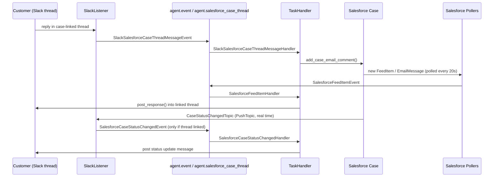

# Salesforce Integration

Tiger Agent can keep a Salesforce Case and a Slack thread in sync in both directions: replies in the Slack thread become comments on the case, and Chatter posts/emails/status changes on the case are mirrored into the thread. This document covers how that link is established, how each direction of sync works, and how the system stays consistent when Salesforce push notifications are missed.

Salesforce support is entirely optional — it activates only when `get_salesforce_api_client()` returns a client (Salesforce credentials are configured), which is what causes `HarnessContext.salesforce_client` to be set and `SalesforceListener` to be added to the `ListenerHarness` (see [Task Harness Architecture](event_harness.md#the-listener-pattern)).

## The Case ↔ Thread Link

The link is a single row in `agent.salesforce_case_thread` (channel_id, thread_ts, case_id) — see [Database](database.md). Everything else in this document is either **creating** that row or **using** it to route a message to the other side.

```sql
create table agent.salesforce_case_thread
( channel_id text not null
, thread_ts  text
, case_id    text not null
);
```

### Prerequisite: linking a Slack channel to a Salesforce account

Both paths below depend on a *separate* table, `agent.customer_channel_salesforce_link` (`channel_id` primary key → `salesforce_account_id`), that maps a customer's dedicated Slack channel to their Salesforce `Account`. Unlike `agent.salesforce_case_thread`, nothing in the event pipeline populates this table automatically — it's maintained by admins through the `salesforce customer-channel` admin slash command (`tiger_agent/slack/slash_commands/handlers/salesforce/{add,remove}_customer_channel.py`, registered in `tiger_agent/slack/slash_commands/registry.py`):

- **`/<bot-name> salesforce customer-channel add <channel_id> <salesforce_account_id>`** — `upsert_salesforce_account_id_for_channel()` writes the row, then the bot posts a welcome message into that channel ("Hi there! I'm ... you can get assistance by @mentioning me in this channel").
- **`/<bot-name> salesforce customer-channel remove <channel_id>`** — `remove_salesforce_account_id_for_channel()` deletes the row.

Like all admin slash commands, both are gated to admins via `user_is_admin()` (see [Task Harness Architecture](event_harness.md#the-listener-pattern)). Once a channel is linked, it's used for two things: auto-threading new cases created for that account (below), and authorizing that channel to create new Salesforce cases from Slack ([Creating a case from Slack](#creating-a-case-from-slack)).

There's also a manual escape hatch, `salesforce create-notification <case_id>`, which re-enqueues a `SalesforceAssignmentChangedEvent` for a given case (with `update_link_to_thread=False`) to resend the assignment notification to `SALESFORCE_CASE_CHANNEL` — useful if the PushTopic subscription and the reconciliation poller both missed a case.

### How the link gets created

There are two paths that establish a link, both via `create_slack_thread_for_case()` (`tiger_agent/tasks/handlers/utils.py`):

1. **Case created for an account with a known Slack channel** — `SalesforceCaseCreatedHandler` looks up `agent.customer_channel_salesforce_link` by the case's `AccountId`. If a channel is linked to that account, a thread is started immediately, before anyone is even assigned.
2. **Case created from Slack** — a user runs the "create a case" workflow (see [Creating a case from Slack](#creating-a-case-from-slack) below); `SalesforceCreateCaseHandler` looks up the submitting channel's linked account in the same table (refusing to create a case if none is found) and immediately threads the new case in that channel.

In both cases, `create_slack_thread_for_case()` posts a "*Support Case Created*" summary message, records the `(channel_id, thread_ts, case_id)` row, and — if `SALESFORCE_SLACK_CUSTOMER_THREAD_FIELD` is configured — writes the thread's permalink back onto the Salesforce case.

**A third path does *not* create the link.** When a case is simply assigned to an owner (`SalesforceAssignmentChangedHandler`, triggered by `CaseOwnerChangedTopic`), the handler runs the agent to summarize the case and posts it to `SALESFORCE_CASE_CHANNEL`, and may write a thread permalink onto the case if `event.update_link_to_thread` is set — but it never calls `create_slack_thread_for_case()`, so no `agent.salesforce_case_thread` row is created. That thread is a one-way "here's a new case, FYI" notification with a feedback-request reminder attached ([see below](#feedback-on-assignment)); it does not participate in the bidirectional comment/feed sync described here unless a link was independently established through one of the two paths above.

## Salesforce → Slack

### New Chatter posts and emails on a case

Neither Chatter `FeedItem` nor `EmailMessage` support PushTopics or Change Data Capture, so `SalesforceCaseFeedItemPoller` (`tiger_agent/salesforce/case_feed_item_poller.py`) polls every 20 seconds for `TextPost`/`ContentPost` feed items and inbound email messages created since the last poll, filters out ones already processed (`filter_new_feed_items`), and calls the listener's `handle_new_feed_item` for each — which strips any quoted "Original Message" trailer and enqueues a `SalesforceFeedItemEvent`.

`SalesforceFeedItemHandler` then:
1. Looks up the thread for `feed_item.ParentId` via `get_salesforce_case_thread_thread_id()` — if there's no link, it's a no-op.
2. Converts the feed item's HTML body to Slack mrkdwn (`HTMLSlacker`) and wraps it in a quote block, attributed to the Salesforce author.
3. Downloads any feed attachments and posts the message (with attachments) into the linked thread.

Outbound emails the agent itself sends when syncing a Slack reply (below) are excluded from this poll by `exclude_creator_id` — otherwise the sync would echo the agent's own comments back into the thread.

### Case status changes

`CaseStatusChangedTopic` streams in real time; `SalesforceListener.handle_case_status_changed` looks up the thread for the case and, if one exists, enqueues a `SalesforceCaseStatusChangedEvent`. `SalesforceCaseStatusChangedHandler` simply posts `_Case status updated to_ \`<Status>\`` into that thread. Cases with no linked thread are silently ignored — status changes are only interesting once someone is watching the thread.

### New case created (spam triage)

`CaseCreatedTopic` fires `SalesforceListener.handle_case_created` → `SalesforceCaseCreatedEvent` → `SalesforceCaseCreatedHandler`, which either threads the case immediately (known-account path, above) or, when `SALESFORCE_ENABLE_SPAM_FILTERING` is on, runs a small tool-free triage agent (`assess_case_for_spam`) to flag vendor-solicitation spam. Legitimate new cases don't get a Slack thread from this handler — that happens once the case is *assigned*, via the flow in [Feedback on assignment](#feedback-on-assignment) below, or via the known-account path above.

### Feedback on assignment

`SalesforceAssignmentChangedHandler` fires once a case has `Status = 'New'` and a real owner (`CaseOwnerChangedTopic`, deduplicated by `is_case_assignment_new()` so re-saving the same owner doesn't refire). It runs the full `TigerAgent` to produce a structured `AgentSalesforceResponse` (case summary + optional Slack user id of the owner), posts it to `SALESFORCE_CASE_CHANNEL`, and — for the case owner — schedules an `AgentFeedbackRequestReminderEvent` with a future `vt` (visibility threshold) so a DM reminder to leave feedback fires at the owner's end of day (`AgentFeedbackRequestReminderHandler`). Scheduling a reminder via `vt` rather than a separate cron is the same mechanism the work queue already uses for retries — it's just a task that isn't visible/claimable until later.

### Reconciling missed assignments

Because the assignment/creation flow depends on a live PushTopic subscription, `SalesforceNewCasePoller` (`tiger_agent/salesforce/new_case_poller.py`) runs every 5 minutes and re-queries Salesforce for cases created+assigned in the last day, diffs the result against everything already recorded in `agent.event`/`agent.event_hist` (matching on `event->'case'->>'Id'`), and replays `handle_updated_case_assignee` for anything it finds — the same reconciliation pattern as the feed item poller.

## Slack → Salesforce

### Replies in a case-linked thread

`SlackListener._on_message` checks every threaded reply against `get_salesforce_case_thread_case_id(pool, thread_ts, channel_id)`. If the thread is linked to a case (and the message has text or a file attachment), it enqueues a `SlackSalesforceCaseThreadMessageEvent`.

`SlackSalesforceCaseThreadMessageHandler` then:
1. Fetches the sender's Slack profile and determines whether they're external to the bot's org (`user_is_external`).
2. Converts Slack `@mentions` in the message to links back to profiles, and converts any Slack file attachments into email attachments.
3. Calls `add_case_email_comment()` on the Salesforce client, posting the message as an `EmailMessage`/case comment prefixed with `[Replied via Slack as @user]`, `From`/`To` set based on whether the sender is internal or external.

Because the poller in [New Chatter posts and emails](#new-chatter-posts-and-emails-on-a-case) excludes messages created by the integration user, this doesn't loop back into Slack.

### Creating a case from Slack

Two entry points lead to `SalesforceCreateCaseHandler`:

1. A Slack **shortcut/workflow action** (`NEW_SALESFORCE_CASE_WORKFLOW_FORM_TRIGGER`) opens an ephemeral form (`send_new_salesforce_case_workflow_form`) directly.
2. A **pseudo-slash-command workaround**: Slack does not deliver custom-workflow button clicks to users outside the app's own org, so a workflow instead posts a `bot_message` matching `PSEUDO_SLASH_COMMAND_FOR_NEW_CASE_FORM`; `SlackListener._on_message` parses the target user id out of that message and enqueues a `SlackRequestNewCaseFormEvent`, which `SlackSendNewCaseFormHandler` turns into the same ephemeral form.

Submitting the form (`NEW_SALESFORCE_CASE_WORKFLOW_FORM_SUBMIT`) enqueues a `SalesforceCreateNewCaseEvent` with the parsed subject/description/service/project/customer-impact fields. `SalesforceCreateCaseHandler` looks up the Salesforce account linked to the submitting channel (`agent.customer_channel_salesforce_link`) — refusing to create a case if the channel has no linked account — creates the case with `origin="Slack"`, and threads it via `create_slack_thread_for_case()`, establishing the link described above.

`slack-manifest.json` also reserves a second slash command (`/support-command` by default) described as "creating a Salesforce case" — as of this writing it is not wired to a handler in the admin command registry (`tiger_agent/slack/slash_commands/registry.py`, which currently only exposes `salesforce create-notification`, `salesforce customer-channel add/remove`, `messages delete`, and `users admins/ignored add/list/remove`, all gated to admins). In practice, case creation from Slack happens through the workflow-button/form path above. See [Creating a Slack App](slack_app.md) for the manifest configuration.

## End-to-End Sequence



## Related Configuration

- `agent.customer_channel_salesforce_link` — maps a Slack channel to a Salesforce `AccountId`; maintained via the `salesforce customer-channel add|remove` admin slash command (see [Prerequisite: linking a Slack channel to a Salesforce account](#prerequisite-linking-a-slack-channel-to-a-salesforce-account)). See also [Database](database.md).
- `SALESFORCE_CASE_CHANNEL` — where assignment-summary notifications post when no thread is linked yet.
- `SALESFORCE_SLACK_THREAD_FIELD` / `SALESFORCE_SLACK_CUSTOMER_THREAD_FIELD` — optional Salesforce fields the agent writes the Slack thread permalink into.
- `SALESFORCE_ENABLE_SPAM_FILTERING` — gates the spam-triage agent on newly created cases.
- `USER_DEFINED_EVENTS_ENABLED` — if enabled, every event described here (Salesforce or Slack) is also checked against `agent.user_defined_rules` after its normal handler runs, and can trigger a separate `UserDefinedRuleMatch` action. See [Task Harness Architecture](event_harness.md#the-handler-pattern).
